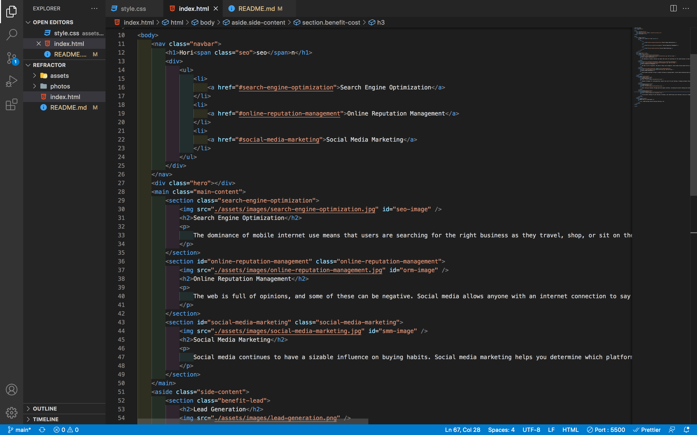

# refractor

### Refactored a website's code with the features still working but it was difficult to read. By implementing semantic HTML, I was able to get rid of a lot of the divs that was previously used. Changes made include: changing the element names, changing the element class and id names, and adjusting the CSS accordingly to the HTML changes. These changes make it easier to read and know where the code goes on the website.

# Languages Used

### HTML and CSS were used in this project

# Usage

### 

### Here is a screenshot of the HTML. As you can see, semantic HTML was used and it's easier to see where class and id elements belong on the website. As stated above, mostly divs were used beforehand.

# Link

### https://github.com/callanhunter/refractor
